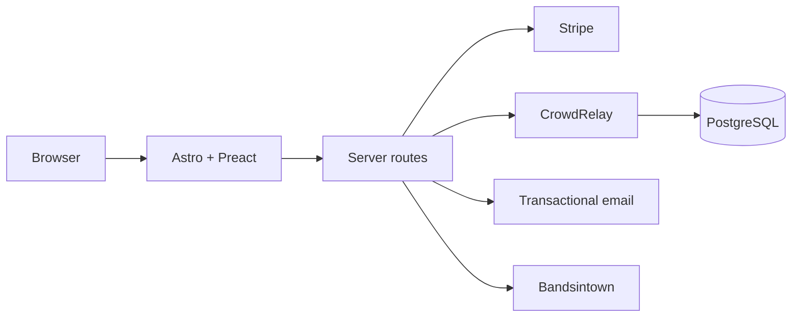

# virya.music

**Public website and operational frontend for VIRYA.**

The site turns Virya's music, shows, merch and fan experiences into the band's public web surface. It owns presentation, server-side integration routes and the AREA game ledger; durable fan, consent, ticket, admission, draw and inventory state stays in [CrowdRelay](https://github.com/wojciechbator/crowdrelay).

## Features

- multilingual music, lyrics, video, gallery, press and live-event pages;
- Stripe merch checkout with InPost delivery;
- ticket reservations and webhook reconciliation backed by CrowdRelay;
- VIRYA AREA browser game;
- Virya Signal fan registration, consent, referrals and event interest;
- Synesthesia entry points and staff-side draw configuration;
- admission-pass and concert check-in flows;
- private staff panel for concert operations;
- server-rendered routes for trusted integrations.

The site is static-first: interactive code is limited to the surfaces that need it, while secrets and privileged integrations remain server-side.

## Tech stack

Astro 7 with SSR on Netlify, Preact islands, Tailwind 4 and TypeScript. Stripe handles payments, CrowdRelay owns durable business state, and Bandsintown supplies the public live feed.

See [`docs/ARCHITECTURE.md`](docs/ARCHITECTURE.md) for the durable runtime boundaries and integration model.

## License

See [`LICENSE`](LICENSE).
