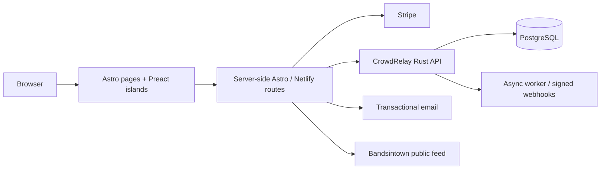

# virya.music

[](https://github.com/wojciechbator/virya/actions/workflows/build.yml)

**Astro 7 SSR on Netlify + Preact islands.** The production website and operational frontend for [Virya](https://www.virya.music).

It started as a fast multilingual band site and is now the band's whole public surface: music and press pages, merch and ticket checkout, fan registration, a geolocation field game and a private staff panel. Every durable business fact behind those surfaces — fan consent, referrals, tickets, admission, draws — lives in [CrowdRelay](https://github.com/wojciechbator/crowdrelay); this repository owns presentation, server-side integration routes and the AREA game's own ledger.

The public site stays static-first. Interactive code loads only for the surfaces that need it, and the browser never receives Stripe secrets, CrowdRelay admin keys or staff credentials.

## Engineering snapshot

- **Static-first by default:** no global application hydration; interactive code ships only for the islands that need it, and CrowdRelay code is never imported by the global layout.
- **Server-held secrets:** checkout creation, webhooks and privileged state stay in server-side routes.
- **Separate state boundaries:** AREA and Signal are independent, so a CrowdRelay outage cannot invalidate an already committed AREA reward.
- **Bounded external calls:** public API calls use bounded timeouts and cached fallbacks; third-party embeds stay outside the initial render.
- **Failure is visible, not blank:** a runtime guard loads before Astro navigation and surfaces uncaught client failures; middleware turns uncaught server failures into correlated no-store responses.
- **Cache discipline:** the service worker always returns a concrete fallback and never caches ticket capabilities or staff pages.
- **No second backend:** business policy — consent, winner selection, fulfillment, inventory — is CrowdRelay's. This repo does not re-implement it.
- **Render budget:** explicit image dimensions with generated placeholders, and prefetch on intent rather than across every page.

The deployed site is kept at 100 across the Lighthouse audits tracked for performance, accessibility, best practices and SEO.

## Features

- music, lyrics, video, gallery, press and live-event pages;
- Stripe merch checkout with InPost delivery;
- first-party Stripe ticket reservations and webhook reconciliation backed by CrowdRelay;
- VIRYA AREA, a browser-based geolocation field game;
- Virya Signal fan registration, consent, referrals, event interest and anonymous in-app feedback;
- Synesthesia album-experience entry points and the staff-side five-CD draw configuration;
- admission-pass and concert check-in flows backed by CrowdRelay;
- a private staff panel for rotating concert QR campaigns;
- server-rendered Netlify routes for trusted integrations.

## Tech stack

Astro 7 with SSR on Netlify, Preact 10 islands, Tailwind 4, TypeScript. Stripe for payments, CrowdRelay for durable business state, Bandsintown for the public live feed.



More detail: [architecture](docs/ARCHITECTURE.md).

### Runtime boundaries

| Surface | Owner |
|---|---|
| Static pages, SEO and presentation | Astro |
| Interactive merch, Signal and AREA UI | Preact islands |
| Checkout creation and webhooks | server-side routes + Stripe |
| AREA challenges, claims and vouchers | AREA server modules and durable ledger |
| Fan consent, referrals, events, draws and admission | [CrowdRelay](https://github.com/wojciechbator/crowdrelay) |
| Anonymous Signal feedback | bounded first-party route + durable HMAC rate limit + site mailer |
| Operational notifications and delivery | asynchronous workflows |

## Local development

```sh
npm ci
cp .env.example .env.development
npm run dev
```

Run the complete source checks before a pull request:

```sh
npm test
npm run build
```

`npm test` runs TypeScript validation and source-level audits for AREA and Signal. The build generates responsive image placeholders before Astro compiles the site. Run `npm run quality` before release.

## Security

The repository contains examples only. Production environment files, generated Netlify output and local deployment state are ignored.

Report security issues privately as described in [SECURITY.md](SECURITY.md).

## Author

Website and systems: [Wojciech Bator](https://www.wojciechbator.me) · [GitHub](https://github.com/wojciechbator)
