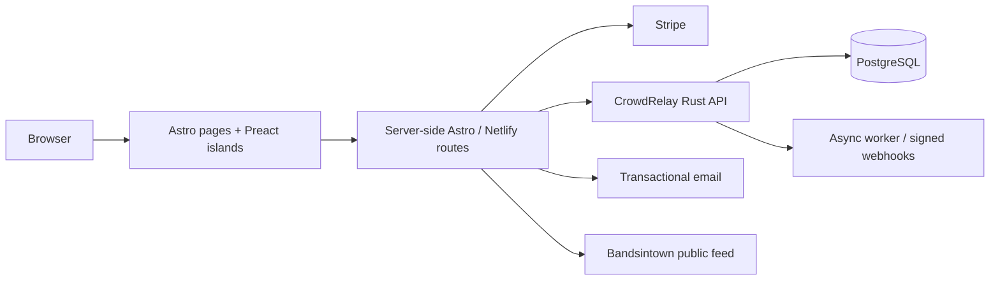

# virya.music

[](https://github.com/wojciechbator/virya/actions/workflows/build.yml)

This repository contains the production website and operational frontend for [Virya](https://www.virya.music).

It started as a fast multilingual band site. It now includes:

- music, lyrics, video, gallery, press and live-event pages;
- Stripe merch checkout with InPost delivery;
- first-party Stripe ticket reservations and webhook reconciliation backed by CrowdRelay;
- VIRYA AREA, a browser-based geolocation field game;
- Virya Signal fan registration, consent, referrals, event interest and anonymous in-app feedback;
- Synesthesia album-experience entry points and the staff-side five-CD draw configuration;
- admission-pass and concert check-in flows backed by CrowdRelay;
- a private staff panel for rotating concert QR campaigns;
- server-rendered Netlify routes for trusted integrations.

The public site remains static-first. Interactive code loads only for the surfaces that need it.

## Architecture



The browser never receives Stripe secrets, CrowdRelay admin keys or staff credentials.

Public content does not wait for email or automation delivery. AREA and Signal have separate state boundaries so a CrowdRelay outage cannot invalidate an already committed AREA reward.

More detail: [architecture](docs/ARCHITECTURE.md).

## Local development

```sh
npm ci
cp .env.example .env.development
npm run dev
```

Run the complete source checks before a pull request:

```sh
npm test
npm run build
```

`npm test` runs TypeScript validation and source-level audits for AREA and Signal. The build generates responsive image placeholders before Astro compiles the site.

## Runtime boundaries

| Surface | Owner |
|---|---|
| Static pages, SEO and presentation | Astro |
| Interactive merch, Signal and AREA UI | Preact islands |
| Checkout creation and webhooks | server-side routes + Stripe |
| AREA challenges, claims and vouchers | AREA server modules and durable ledger |
| Fan consent, referrals, events, draws and admission | [CrowdRelay](https://github.com/wojciechbator/crowdrelay) |
| Anonymous Signal feedback | bounded first-party route + durable HMAC rate limit + site mailer |
| Operational notifications and delivery | asynchronous workflows |

## Performance rules

- no global application hydration;
- explicit image dimensions and generated placeholders;
- third-party embeds stay outside the initial render;
- CrowdRelay code is not imported by the global layout;
- public API calls use bounded timeouts and cached fallbacks;
- privileged state remains server-side;
- prefetch happens on intent rather than across every page.

The deployed site is kept at 100 across the Lighthouse audits tracked for performance, accessibility, best practices and SEO.

## Reliability and diagnostics

The global runtime guard loads before Astro navigation, records bounded privacy-safe diagnostics, and surfaces uncaught client failures instead of leaving a blank page. Middleware converts uncaught server failures into correlated no-store responses. The service worker always returns a concrete fallback response and never caches ticket capabilities or staff pages.

Run `npm run quality` before release.

## Security

The repository contains examples only. Production environment files, generated Netlify output and local deployment state are ignored.

Report security issues privately as described in [SECURITY.md](SECURITY.md).

## Author

Website and systems: [Wojciech Bator](https://www.wojciechbator.me) · [GitHub](https://github.com/wojciechbator)
